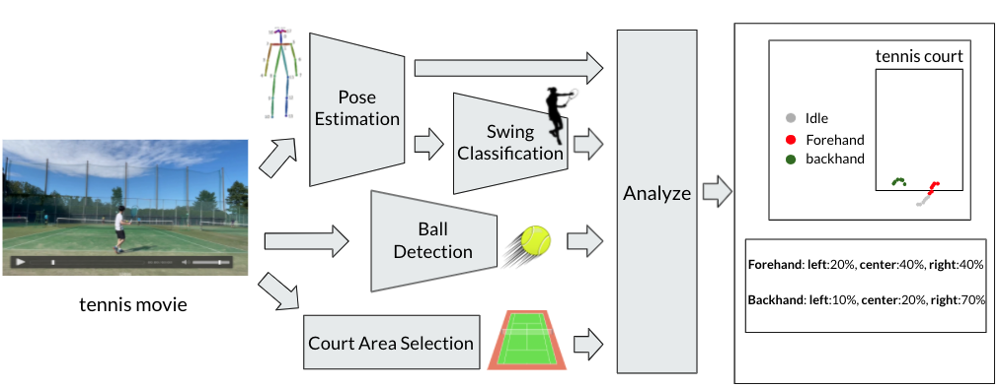
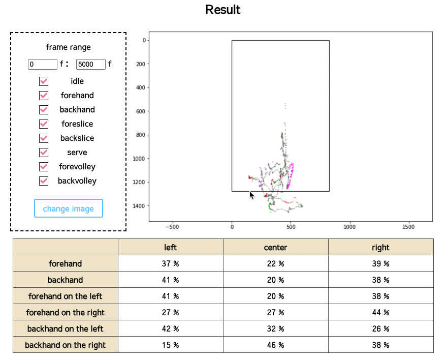
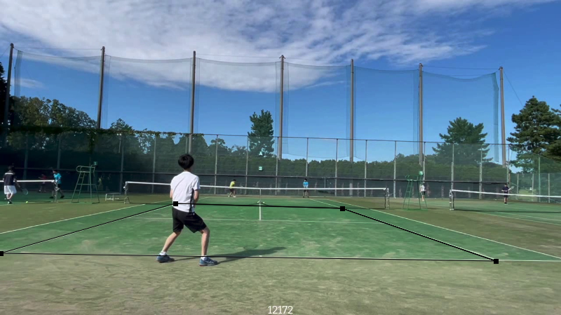

# Tennis Analyzer


This is a repository that takes a tennis video as input and analyzes its content.  
The flow is as shown in the following figure.

## overview

Result


Table of contents
1. app usage 
2. Pose Estimation
3. Swing Classification
4. Ball Detection
5. Court Area Selection
6. Analyze

## 1. App Usage
1. Clone this repository
```bash
git clone https://github.com/noji0101/tennis_analyzer
```
2. download trained weight  
```bash
cd tennis_analyzer
mkdir data
mkdir -p data/simple_HRNet/weights/
mkdir -p data/TrackNet/weights/
mkdir -p data/swing_classifier/weights/
```
2.1 HRnet  
Download the weights from [here](https://drive.google.com/open?id=1UoJhTtjHNByZSm96W3yFTfU5upJnsKiS) and put it in "data/simple_HRnet/weights/".

Get YOLOv3:  
- Clone [YOLOv3](https://github.com/eriklindernoren/PyTorch-YOLOv3/tree/47b7c912877ca69db35b8af3a38d6522681b3bb3) in the folder modules/simple_HRNet/models/detectors and change the folder name from PyTorch-YOLOv3 to yolo 
- Download the pre-trained weights running the script download_weights.sh from the weights folder


2.2 TrackNet  
Download the weights from [here](https://nol.cs.nctu.edu.tw:234/open-source/TrackNet/raw/master/Code_Python3/TrackNet_Three_Frames_Input/weights/model.3) and put it in "data/TrackNet/weights/".

2.3 swing classifier  
Download the weights from [here](https://drive.google.com/file/d/1CPP2AnTb5UNkEnUoXwWt1VtWw61R26Ea/view?usp=sharing) and put it in "data/swing_classifier/weights/".


3. Build docker image
```bash
docker build ./ -t {your-image-name} --build-arg USER_ID=$(id -u) --build-arg GROUP_ID=$(id -g)
```
4. Run docker image
```bash
docker run -it --gpus '"device=0"' -p 8800:88 -v /home/{user}/Object-Detection-App:/home/duser/workspace --name {container-name} {your-image-name}
```
5. start flask app

```bash
cd workspace
mkdir -p app/static/uploads
python app/app.py
```
6. Accees {IP Address}:8888 on your browser

7. Input tennis movie.

8. Follow the app's instructions and click on the corner of the tennis court

9. Push the send button and wait for a while. Then you'll get result.  
You can choose which swings you want to show and the range of frames.


## 2. Pose Estimation

For pose estimation, I refer to the following papers and repository.  

paper : [Deep High-Resolution Representation Learning for Human Pose Estimation](https://arxiv.org/abs/1902.09212)  
repositry : [simple-HRnet](https://github.com/stefanopini/simple-HRNet)  
A modified version of this repository for this project is included in the modules/simple-HRnet.


## 3. Swing Classification

I used LSTM model.
The input is player's keypoints each frame.
The output is swing classes.

swing class example：  
Idle, Forehand, Backhand, Foreslice, Backslice, serve, Forevolley, Backvolley, Out of frame  
These correspond to  
0, 1, 2, 3, 4, 5, 6, 7, 8  
### train Swing classifier

train
```bash
python modules/swing_classifier/trian.py --configfile config/config.yaml
```

eval
```bash
python modules/swing_classifier/trian.py --configfile config/config.yaml --eval
```

## 4. Ball Detection

For ball detection, I refer to the following papers and repository.  

paper : [TrackNet: A Deep Learning Network for Tracking High-speed and Tiny Objects in Sports Applications](https://arxiv.org/abs/1907.03698)  
repositry : [TrackNet](https://nol.cs.nctu.edu.tw:234/open-source/TrackNet/tree/master)  
A modified version of this repository for this project is included in the modules/simple-HRnet.

## 5. Court Area Selection

In the web app, the user is asked to click on the court at the front end and get the coordinates of the four corners of the tennis court.


## 6. Analyze

With there obtained data (human joint coordinates, swing classes, ball coodinates, and court coodinates), this model outputs two analysis results.

- the player's position and the type of swing at the time, as seen from above on the court
- Forehand and backhand's shot direction tendencies
